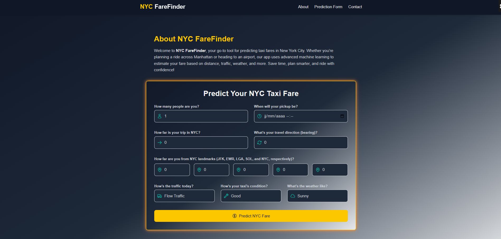
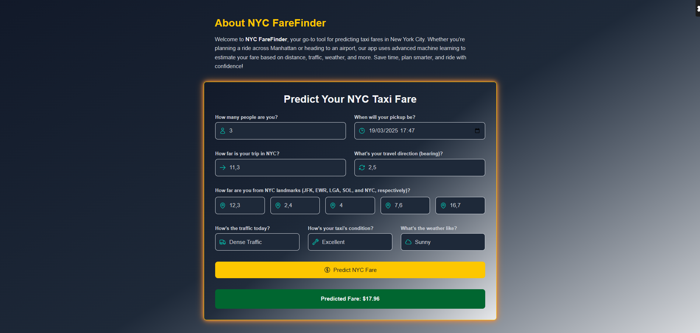

# NYC FareFinder Web App 🚖💵

NYC FareFinder is a web application designed to predict taxi fares in New York City using machine learning. Built with a modern tech stack, the app leverages an **Extra Trees Regressor** model (R² score of 0.94) to provide accurate fare predictions, helping users plan their trips efficiently.

## Screenshots
Below are some screenshots showcasing the NYC FareFinder interface:

| **Fare Prediction Form** | **Prediction Result** |
|--------------------------|-----------------------|
|  |  |


## Features
- **Accurate Fare Prediction**: Predicts taxi fares using an Extra Trees Regressor (R² score: 0.94) based on factors like passenger count, traffic, weather conditions, pickup time, and distance.
- **Responsive Design**: Fully responsive layout using Tailwind CSS, with a glowing form border for user inputs.

## Tech Stack
- **Frontend**: Vite, React (TypeScript), Tailwind CSS
- **Backend**: Django (Python)

## Prerequisites
Before setting up the project, ensure you have the following installed:

- **Node.js**: `v22.14.0`
- **npm**: `11.2.0`
- **Python**: `3.11.9`

## Project Structure
The project is divided into three main directories:
- `fare-prediction-frontend/`: Contains the React frontend.
- `fare_prediction/`: Contains the Django backend and ML models.
- `notebooks/`: Contains Jupyter notebooks for EDA, Preprocessing and Training of various Regressor models.

### How to Use the Notebooks
1. **Option 1: Train the Model Yourself**
   - Download the dataset from [this link](https://mega.nz/file/FP12nADK#j-Rd32Ohe6FEf_sYKCN7qriiFdpLGJiNReprFsob938).
   - Navigate to the `notebooks/` directory and run the Jupyter notebooks in order.

2. **Option 2: Use the Pre-Trained Model**
   - Download our existing trained Extra Trees Regressor model from [this link](https://your-model-hosting-service.com/extra_trees_model.pkl).
   - Place the `Extra_Trees.pkl` file in the `fare_prediction/models/` directory.

## Setup Instructions

### Step 1: Clone the Repository
Clone the project repository to your local machine:
```bash
git clone https://github.com/mohababsa/nyc-farefinder.git
cd nyc-farefinder
```

### Step 2: Set Up the Virtual Environment
Create and activate the virtual environment:
```bash
python -m venv fare_prediction_venv
.\fare_prediction_venv\Scripts\activate  # Windows
# For macOS/Linux: source fare_prediction_venv/bin/activate
```
Install python dependencies:
```bash
pip install -r requirements.txt
```

### Step 3: Set Up the Backend (Python/Django)
Navigate to the backend directory and run the Django development server to ensure the backend is working:
```bash
cd fare_prediction
python manage.py runserver
```
The backend should be accessible at `http://localhost:8000`.

### Step 4: Set Up the Frontend (React)
Navigate to the Frontend Directory:
```bash
cd ../fare-prediction-frontend
```
Ensure you have `Node.js` `v22.14.0` and `npm 11.2.0`. Install the required packages:
```bash
npm install
```
The app uses icons from `@heroicons/react/24/outline`. Install it:
```bash
npm install @heroicons/react
```
Verify `Tailwind CSS` and `Vite` Configuration.
Start the React development server:
```bash
npm run dev
```
The frontend should be accessible at `http://localhost:5173`.

## Contributing
Contributions are welcome! Please fork the repository, create a new branch, and submit a pull request with your changes.

## License
This project is licensed under the MIT License. See the [LICENSE](./LICENCE) file for details.

## Acknowledgments
Built as part of an internship project at [**CellulaTechnologies**](https://www.linkedin.com/company/cellula-technologies/posts/?feedView=all).
